# **非结构化商业文本信息中隐私信息识别**

## 问题背景

比赛赛题地址：[非结构化商业文本信息中隐私信息识别](https://www.datafountain.cn/competitions/472)

随着社交网络、移动通讯等技术的迅速发展，网络中存在大量包含隐私数据的文本信息，如何在非结构化的本文信息中精准识别隐私数据并对其进行保护已经成为隐私保护领域中亟需解决的问题。

本赛题将关注点集中在**隐私属性的识别问题**中，针对非结构化的本文信息进行分析，对文本中所涉及到的隐私信息精准提取。该任务为后续隐私保护操作提供强有力的支撑，是隐私保护领域的重要前提。

## 解决思路

这属于NLP领域的**传统实体识别任务（NER）**，限定实体类别，封闭文本语料。

常用的解决技术包括：

**规则方法**：使用正则表达式匹配邮箱、手机号等。

**序列标注**：对于每个token打标签，标签由实体位置信息（BIO）和实体类型信息（如PER、LOC、ORG）组成。通过这些标签可以识别出实体。

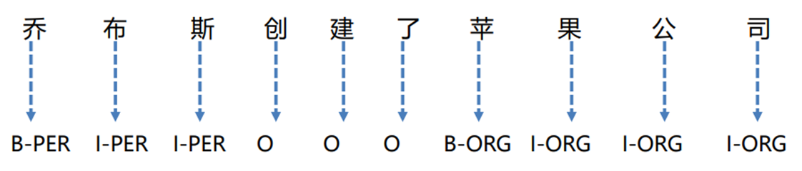

**序列生成：**

- **Seq2Seq**：输入文本作为源文本，生成标注后的目标文本。

- **GPT**：输入文本作为prompt，模型在prompt的基础上，生成标注后的目标文本。

（标注后的目标文本可以是方便抽取实体的任意格式，比如 *<佘达>[name];<建行>[company];<中弘北京像素>[company];<销售总监>[position];<龙坤>[name]* 。）

**阅读理解**：将实体识别转换为阅读理解任务，将输入文本作为context，对于要识别的不同实体类型可以设置不同的问题，比如：找出出现的人名，找出出现的地名等。（https://arxiv.org/abs/1910.11476）

**span枚举**：枚举所有可能的span，span通过分类器，判断span是否是某类实体。（https://aclanthology.org/D18-1309）

我们尝试了 **基于BERT的序列标注方法（NLU）** 和 **基于GPT的序列生成方法（NLG）**，在模型的预测输出之上，我们再利用 **正则表达式（规则方法）** 对手机号、微信号、QQ号进行匹配，提升在这三类实体上的召回率（Recall）。

## 数据集

我们首先对比赛方提供的数据进行分析：

1. 比赛方提供了训练集和测试集，其中：

   训练集样本数量：2514

   测试集样本数量：3955

2. 训练集样本类别：

   隐私数据类别有如下14类：position、name、movie、organization、company、book、address、scene、mobile、email、game、government、QQ、vx。

对比NER经典数据集conll2003（训练集数据有14k，只有PER、ORG、LOC、MISC四类），可以看出本比赛数据集**数据量很少**，而且**实体种类很多**。如何**使用少量的数据对模型进行训练**，**减轻模型过拟合**，**保持模型的泛化能力**，是这个**比赛的关键点**所在。

## 序列标注

序列标注是解决NER问题的经典方法，常用的模型有：

- **CRF**

- **LSTM**（ https://arxiv.org/abs/1508.01991 ）

- **BERT**（ https://arxiv.org/abs/1810.04805 ）

我尝试了BERT、RoBERTa、ERNIE-3.0，带CRF头以及不带CRF头。

为了解决过拟合问题，我尝试使用**LoRA**（ https://arxiv.org/abs/2106.09685 ），减少可训练的参数数量。

### 数据预处理

为了做序列标注，首先需要对比赛方提供的数据进行预处理，转换成**BIO标注**的格式，流程如下：

1. 验证文本比赛方提供的数据中的Pos_b、Pos_e和Privacy字段是否对应，修正或移除不对应的数据；
2. 获取标签列表：对实体使用B、I标注，对非实体使用O标注；
3. 将文本切分成字符列表，并验证字符列表长度和标签列表长度相同；
4. 创建标签到索引的映射，将标签列表转换成对应索引的列表。

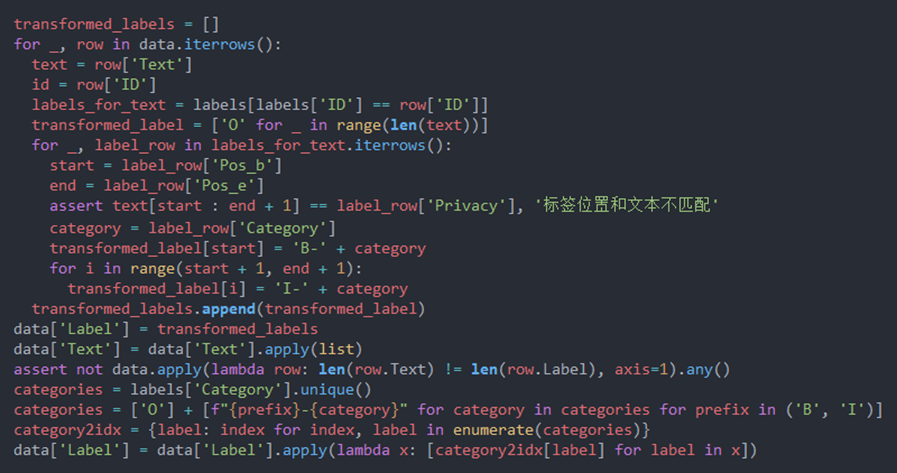

为了方便后面测试模型，我将预处理好的数据集使用Hugging Face的datasets库进行了封装，上传到了Hugging Face仓库中：https://huggingface.co/datasets/gyr66/privacy_detection 。

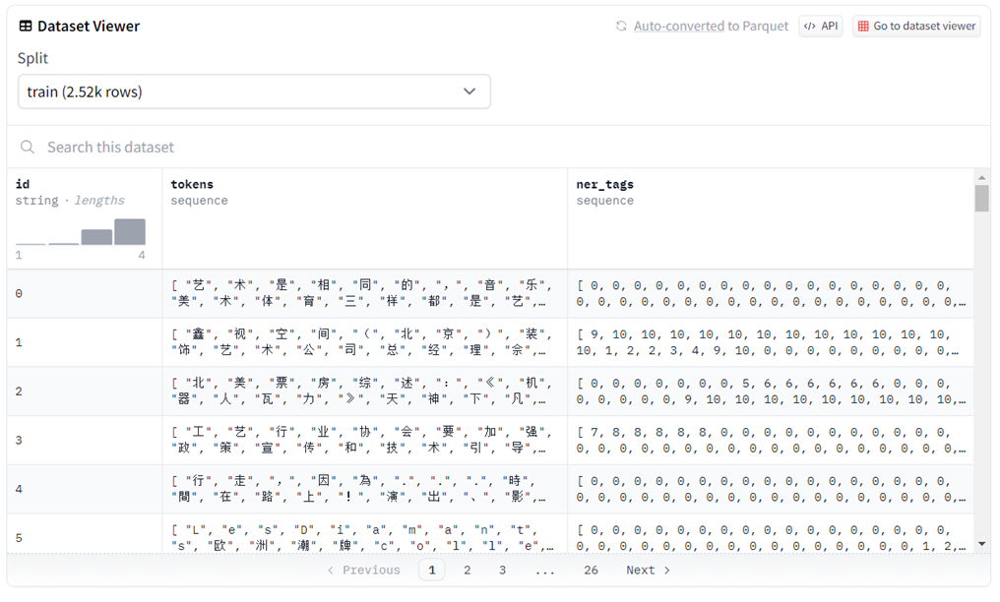

### BERT

我首先尝试使用BERT。使用BERT进行序列标注，只需要将最后一层各个token的hidden state过一下分类头即可。我使用Hugging Face的**transformers**加载预训练模型，**trainer**进行模型训练，**evaluate**进行模型评估。

**由于tokenize之后的token列表可能和输入字符列表长度不同**，这就导致token列表可能没有和label对齐。为了解决这个问题，可以使用Hugging Face的Fast Tokenizer，借助word_ids获得token和输入字符之间的映射，从而得到token和label之间的映射。对于添加的特殊字符（如\<CLS\>、\<SEP\>、\<PAD\>），无法找到对应的label，此时可以将label置为-100，PyTorch的Cross Entropy Loss在计算时会自动忽略这些位置的损失。

模型训练脚本请见： https://github.com/gyr66/privacy_detection/blob/master/train.py 。

数据集是中文，因此要选择中文的BERT，比如bert-base-chinese。为了更加充分发挥预训练模型的能力，我选择了在NER数据集上微调过的BERT作为预训练模型：https://huggingface.co/Danielwei0214/bert-base-chinese-finetuned-ner 。

在比赛数据集上微调，选择验证集（从比赛训练集上切分0.15做验证集）上F1最高的模型作为最终模型。模型在验证集上表现如下：

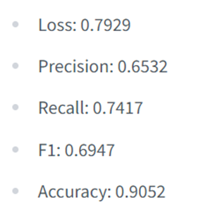

训练好的BERT模型地址：https://huggingface.co/gyr66/bert-base-chinese-finetuned-ner 。

### RoBERTa

RoBERTa在更大的语料上进行了预训练，使用了更大的批量大小，并且使用了动态掩码，在多项任务上表现比BERT要好。我选择了[hfl](https://huggingface.co/hfl/chinese-roberta-wwm-ext-large)[/](https://huggingface.co/hfl/chinese-roberta-wwm-ext-large)[chinese](https://huggingface.co/hfl/chinese-roberta-wwm-ext-large)[-](https://huggingface.co/hfl/chinese-roberta-wwm-ext-large)[roberta](https://huggingface.co/hfl/chinese-roberta-wwm-ext-large)[-](https://huggingface.co/hfl/chinese-roberta-wwm-ext-large)[wwm](https://huggingface.co/hfl/chinese-roberta-wwm-ext-large)[-](https://huggingface.co/hfl/chinese-roberta-wwm-ext-large)[ext](https://huggingface.co/hfl/chinese-roberta-wwm-ext-large)[-large](https://huggingface.co/hfl/chinese-roberta-wwm-ext-large)作为预训练模型，它在预训练阶段采用了**全词MASK（wwm）**（对组成同一个词的汉字全部进行Mask ）。

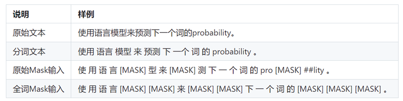

在比赛数据集上微调，选择验证集上F1最高的模型作为最终模型。模型在验证集上表现如下：

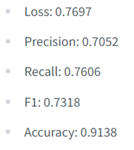

训练好的RoBERTa模型地址：https://huggingface.co/gyr66/RoBERTa-ext-large-chinese-finetuned-ner 。

### RoBERTa + CRF

使用BERT或者RoBERTa，在对token进行分类时，没有考虑token之间的关联。比如B-person后面不应该再跟B-person，而应该是I-person。然而使用BERT或者RoBERTa进行序列标注时有时会出现两个B相连的情况。

为了解决这个问题，可以加入一个CRF头。CRF会将整个标注序列一次解码出来（而不是一个token一个token的解码），考虑了不同标签之间转移的概率（比如B-X到B-X的概率应该很小）。

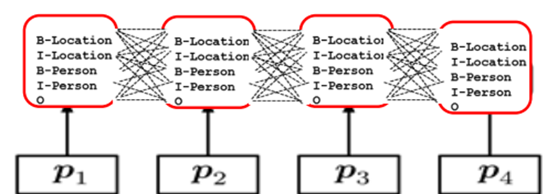

我使用pytorch-crf库（ https://github.com/kmkurn/pytorch-crf ），将其与Hugging Face的预训练模型进行整合，方法如下：

1. 创建模型类**BertCrfForTokenClassification**，继承**BertPreTrainedModel**；

   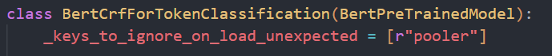

2. 为模型添加**CRF头**和**分类头**，并加载基座模型的权重；

   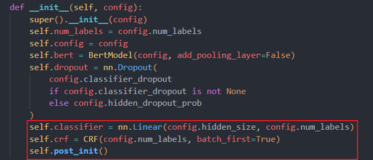

3. 重写forward方法，借助attention_mask生成CRF头需要的**labels_mask**，遮蔽住特殊token，使得CRF头仅关注原始序列。调用decode方法从logits中解码出序列，调用forward方法由logits、labels、mask计算loss（如果传递了label）；

   

4. 由于使用trainer进行训练，forward需要返回**TokenClassifierOutput**类型，以兼容trainer的训练流程。

   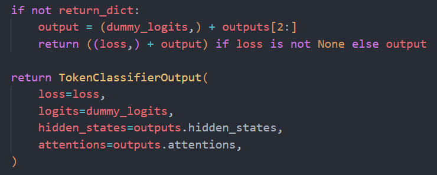

模型代码请见：https://github.com/gyr66/privacy_detection/blob/master/model.py 。

在比赛数据集上微调，选择验证集上F1最高的模型作为最终模型。模型在验证集上表现如下：

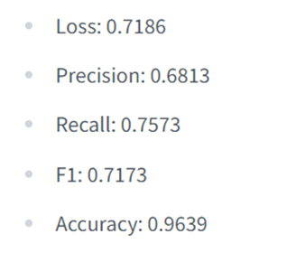

可以看到采用这样的训练策略后，模型的F1值超过了不加CRF头的RoBERTa。

训练好的模型地址：https://huggingface.co/gyr66/RoBERTa-ext-large-crf-chinese-finetuned-ner-v2 。

可以看到，相比于不加CRF头，模型F1值还减少了（之前F1值是0.7318）。我推测可能是因为BERT已经学习到了token之间的关联，因此CRF头对模型效果提升不明显。由于引入了新的参数，而训练数据量很少，模型并没有被训练很好，导致F1值减少。

训练好的RoBERTa + CRF模型地址： https://huggingface.co/gyr66/RoBERTa-ext-large-crf-chinese-finetuned-ner 。

根据推测，模型效果不好可能是因为训练数据少导致CRF头参数没有被训练很好。于是我采取了以下策略：**采用分层学习率：CRF头的学习率设置为底座模型学习率的100倍**；在比赛数据集上微调，选择验证集上F1最高的模型作为最终模型。模型在验证集上表现如下：

 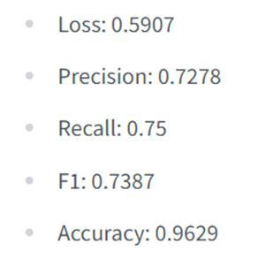

为了方便使用自定义的模型BertCrfForTokenClassification，将模型注册到AutoModelForTokenClassification，并将模型定义文件上传到Hugging Face仓库中。这样可以直接使用AutoModelForTokenClassification.from_pretrained()方法加载使用训练好的带有CRF头的自定义模型，并且可以和token classification的pipeline无缝集成。

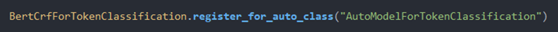

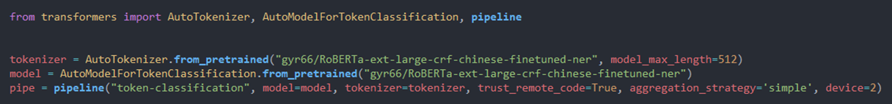

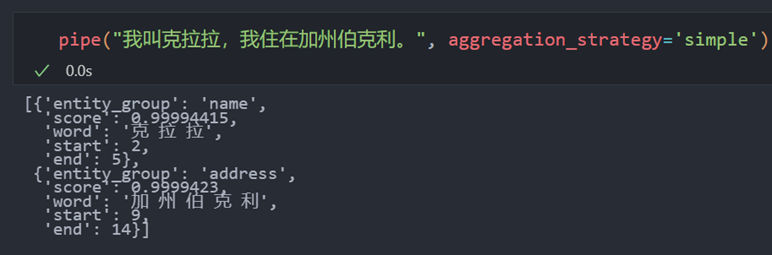

### RoBERTa + LoRA

在前面的实验中，我发现模型出现了严重的过拟合问题，从下图中可以看到**验证集损失约为训练集损失的700倍！**

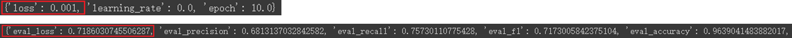

我认为过拟合的主要原因有两个：

1. 模型太大，可训练的参数太多，很快就把训练集的数据全记住了，丢失了泛化能力；
2. 训练集数据太少。

训练集数据是比赛方给的，没法进行扩充。因此，解决过拟合的问题，主要策略是缩小模型规模。然而，大型预训练模型比小型模型包含更丰富的知识。为了能够利用大型模型的知识，同时减轻过拟合，我选择采用**LoRA**（Low-Rank Adaptation）（ https://arxiv.org/abs/2106.09685 ），冻结预训练模型的权重，而仅仅训练少部分额外权重，然后将训练的权重合并到预训练模型中。这种方式大幅度降低了可训练参数的数量，从而有望有效减缓过拟合的问题。

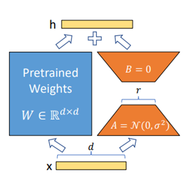

通过前面的实验，在验证集上最好的模型是不加CRF头的RoBERTa，因此我将此模型作为基座模型，训练LoRA参数。

借助Hugging Face的**peft**，可以很容易地使用LoRA对模型进行微调。

创建一个LoRA config，配置矩阵的秩等参数。然后使用get_peft_model方法包装模型即可。

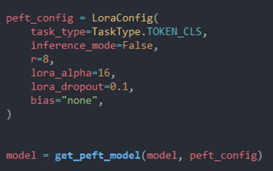

获取模型可训练的参数数量：

*trainable params: 422,941 || all params: 324,925,498 || trainable%: 0.1301655310535217*

可以看到**可训练的参数数量只有总参数数量的0.13%**，这有希望减轻模型过拟合的问题！

在比赛数据集上微调，选择验证集上F1最高的模型作为最终模型。模型在验证集上表现如下：

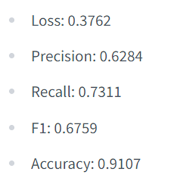

可以看到，该方法并没有取得很好的效果。**验证集上的损失和训练集上的损失并没有之前相差如此巨大，验证集上的损失也要比RoBERTa的损失（0.7697）要小很多，但是F1值却比较小**。

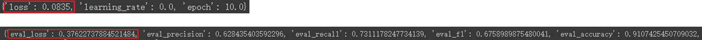

训练好的LoRA参数地址： https://huggingface.co/gyr66/RoBERTa-ext-large-lora-chinese-finetuned-ner 。

尝试使用LoRA减少训练参数的数量来减轻模型过拟合并没有取得很好的效果。我意识到要想真正用少量训练数据得到效果好的模型，仅仅采用trick是没有用的。解决训练集数据量少问题的关键在于**引入外部知识（先验知识）**。比如模型应该在即使没有训练数据的情况下，也能识别哪些是人名、地名等。通过少量数据，向模型示例要找的实体是哪些（即告诉模型某一类实体的含义是什么，比如position，要找的是一些职位实体，如院长、教授等），这样只要基座模型先验知识足够多，应该能够取得很好的效果！为此我首先尝试了百度的**ERNIE 3.0**（ https://arxiv.org/abs/2107.02137 ）。

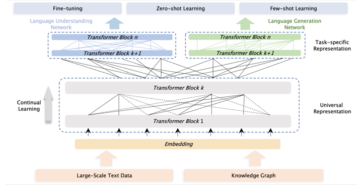

在比赛数据集上微调，选择验证集上F1最高的模型作为最终模型。模型在验证集上表现如下：

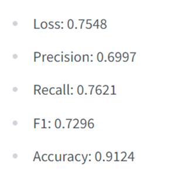

训练好的模型地址： https://huggingface.co/gyr66/Ernie-3.0-large-chinese-finetuned-ner 。

可以看到模型的效果还是不能让人满意。但是我认为引入先验知识的思路是对的，只是目前基座模型比较小，无法取得非常好的效果。于是我将目光转向**大语言模型**。大语言模型具有非常丰富的先验知识，而且有很强的泛化能力，做这项任务应该能够取得很好的效果。

**大语言模型的尝试请见下一节！**

### 最终效果

序列标注方法是解决NER问题的经典方法。我尝试了BERT、RoBERTa、ERNIE-3.0、CRF等模型。所有尝试过的模型都上传到了模型仓库中：https://huggingface.co/gyr66 ，方便后面做模型聚合。

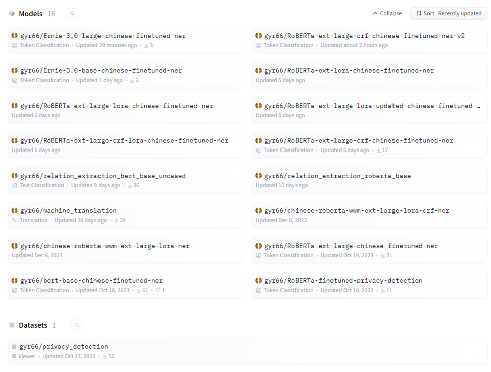

最终，经过测试，基于ERNIE-3.0的模型：https://huggingface.co/gyr66/Ernie-3.0-large-chinese-finetuned-ner ，在比赛方的测试集上表现最好。

inference脚本请见：https://github.com/gyr66/privacy_detection/blob/master/inference.ipynb  。

提交评测，在**测试集上F1值约为0.72**。

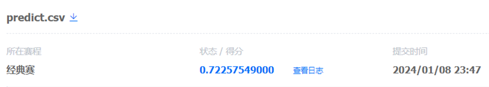

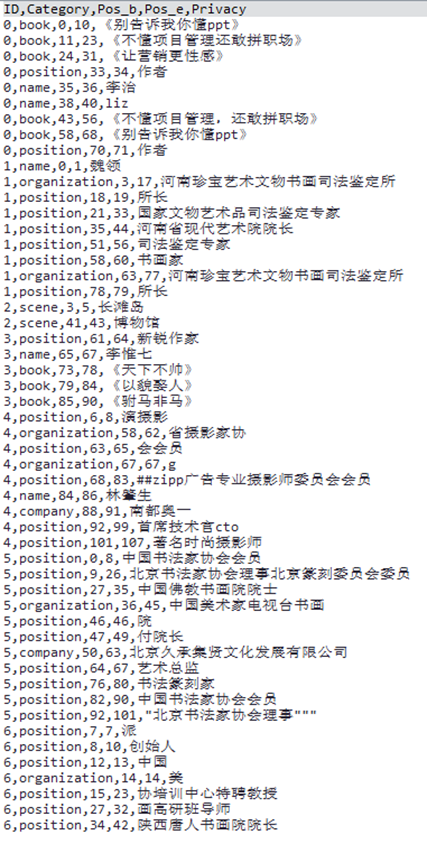

## 序列生成

## 规则法+Ensemble

## 总结
我们选择了非结构化商业文本信息中隐私信息识别这个比赛题目，从非结构化文本中识别出隐私类别实体。
比赛方提供的数据集总共有14类隐私实体，训练集样本数量2.5K。相比较于传统NER任务，实体类别大大增多，训练数据量较少，这是这个比赛的难点所在。
我们首先尝试了解决NER问题经典的序列标注方法，尝试了BERT、RoBERTa、RoBERTa + CRF、RoBERTa + LoRA、ERNIE-3.0等模型。总共训练了13个模型。为了提升比赛分数，我们使用了Ensemble方法，并引入了正则表达式，标注出模型没有识别的邮箱、手机号、QQ号等隐私实体。通过序列标注方法的尝试，我们发现由于训练集样本数量太少，模型过拟合严重。我们认为，解决这个问题的方法是引入先验知识，即模型应该在没有样本的情况下，也能识别出人名、地名这些比较简单类别的实体。而对于比较复杂的实体，比如position，scene等，通过少量样本示例模型，模型能够明白要找的实体类别是什么意思，从而能够很好地在句子中找到对应实体。
于是我们将目光转向大语言模型，大语言模型具有很多先验知识，很符合我们的需求。我们尝试了非常优秀先进的开源GLM模型，设计了模型的输出格式，使用训练集进行微调。首先尝试使用LoRA微调了base版本，发现模型有时不按照输出格式输出，指令遵循能力不强。于是我们又使用p-tuning微调了chat版本。这种方式最终并没有取得很满意的效果。我们认为可能是因为生成式模型并不擅长输出复杂的格式化信息，而且输出的内容可能原序列中没有，造成误差。我们现在认为更好地做法是基于阅读理解的方式，对于每个隐私实体类别训练一个识别模型，通过在指定实体类别上微调，模型应该能够很好地完成这类实体的识别任务。最后将所有模型的识别到的实体组合起来。这种方式可以避免让模型输出复杂结构化信息。未来我们将尝试这种方法，并将结果更新到代码仓库中（ https://github.com/gyr66/privacy_detection ）。
